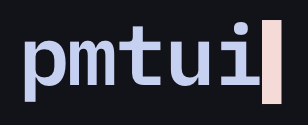
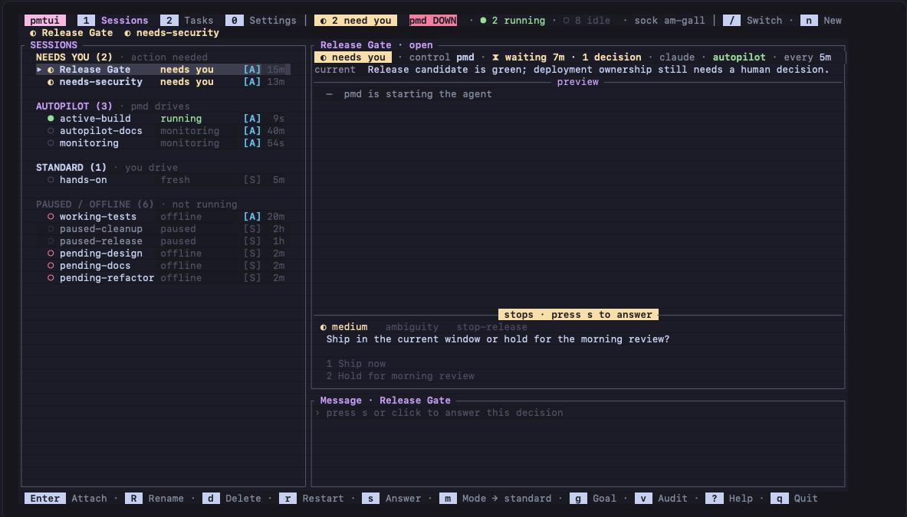
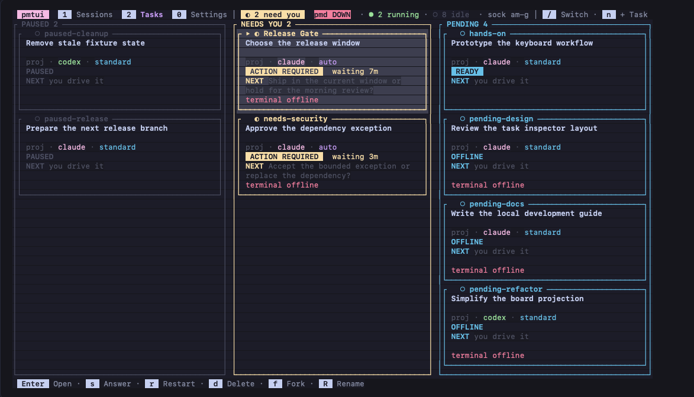

<div align="center">



**Keep one AI coding agent per project moving toward its goal — and only pull you in when a decision genuinely needs a human.**


[Install](#install) · [Quick start](#quick-start) · [Keys](#keys-pmtui) · [Guide](docs/GUIDE.md) · [Spec](docs/SPEC.md)

</div>

---

`pmtui` is a native Rust supervisor for long-running `claude` / `codex` sessions. Each project
session owns **one persistent tmux terminal**. It gets nudged on a cadence so it keeps making
progress toward a goal you set, and reaches you **only when a decision genuinely needs a human**.



**Sessions** — every project grouped by who drives it, with the selected session's live transcript
beside it. The rail tells you where you are needed; the pane tells you why.



**Tasks** — the same sessions as cards, in the columns that answer "what should I do next".

Two binaries:

- **`pmd`** — an optional headless driver. For each enabled project it runs the heartbeat: nudge
  the agent when it goes idle, read the decision marker it writes, detect stalls, and route
  escalations to the log and desktop notifications.
- **`pmtui`** — a ratatui dashboard over those projects. It is **file-based**: it reads each
  project's on-disk state to render and writes files to act, so it works whether or not the
  daemon is running.

## Install

```bash
curl -fsSL https://raw.githubusercontent.com/hung-phan/pmtui/main/install.sh | bash
```

That puts `pmd` and `pmtui` in `~/.local/bin` — a prebuilt, checksum-verified binary for your
platform when one is published, otherwise a `cargo` build from source. The Linux binaries are
statically linked, so they do not care which distribution or libc version you run; and the
installer starts each downloaded binary before installing anything, falling back to a source build
if it will not run on your machine. **tmux** is required at
runtime and managed launches need **tmux 3.0 or newer**; the installer tells you how to get it, and
`pmd doctor` reports a tmux that is too old. If `~/.local/bin` is not on your `PATH`, the installer
prints the one line to add.

Installed commands are thin wrappers that check for updates in the background at most once a day
and run the real binary immediately, so opening is never blocked. Updating, uninstalling, pinning
a version and source-only builds are all flags on the same script — see
[the installer FAQ](docs/GUIDE.md#faq).

## Quick start

```bash
pmtui          # open the dashboard
pmd            # run the driver (optional; it is what drives autopilot rows)
pmd doctor     # inspect setup and state, changing nothing
```

Both read `~/.config/pmd/registry.json` and the private tmux socket `pmd` by default; `--registry`
and `--socket` override them, and `--help` lists the rest.

In the dashboard:

1. **`n`** creates a session. Point it at a project directory, and optionally type a first
   **Message** — the interactive Claude/Codex terminal starts on it right away. Leave it empty to
   start at the agent's prompt. The **Name** field is an optional human-readable label.
2. **`enter`** attaches you to that session's terminal. It is an ordinary `claude`/`codex` REPL:
   work in it, press **`ctrl+q`** to leave it, and the session keeps its conversation — the agent
   keeps running, and you are back on the dashboard.
3. **`m`** turns on **autopilot**. From then on a running `pmd` nudges that session on its
   cadence, auto-handles ordinary choices, and escalates the rest to you. Give an autopilot
   session a goal with **`g`** — it is the direction every nudge steers by.
4. **`1`**, **`2`** and **`0`** switch views: **Sessions**, the terminal-first list with the selected
   session's transcript beside it, **Tasks**, the same sessions as cards in Paused, Needs You,
   Pending, Autopilot and Working columns, and **Settings**, a table of preferences where **Enter**
   opens a row's dropdown — today that is the theme, from the 38 `opaline` ships. The active view is
   the underlined tab in the header.
5. **`s`** sends one message without taking over the terminal, or answers an open decision.
   **`?`** lists every key.

The mouse works wherever the keyboard does: click a row or card to select it, the preview title to
attach, or any visible keybar chip to run it.

Next: [**docs/GUIDE.md**](docs/GUIDE.md) walks through autopilot, goals, directives and the
session list.

### Keys (`pmtui`)

| Key | Action | Key | Action |
|---|---|---|---|
| `j` / `k` | move selection | `/` | find and switch session |
| `1` / `2` / `0` | select the Session, Task or Settings view | `n` | new session |
| `enter` | attach (or **resume** a paused row) | `s` | message, or answer an open stop |
| `ctrl+q` | leave an attached session, back to the dashboard (the agent keeps running) | | |
| in the message, goal and directive fields: `^J` new line (`alt+enter` too), `alt+b`/`alt+f` word, `^w` kill word, `^x^e` $EDITOR | | | |
| `f` | fork conversation into a new Standard session | | |
| `R` | rename the selected session | | |
| `m` | mode — the autonomy tier (`standard` ⇄ `autopilot`) | `g` | edit the goal |
| `d` | delete session | `p` | pause |
| `c` | cadence | `r` | restart the agent |
| `i` | edit the standing directive (autopilot) | `e` | pick the decider **engine + model** (autopilot) |
| `q` | quit | `v` | turn and decision audit (autopilot) |
| `w` | set the **worker model** for the selected session (restart to apply) | `?` | key reference |

## Handing work to a child job (`pmtui spawn`)

An agent inside a managed session can hand an independent piece of work to a **child job**: one
headless run that does the task, reports a result and exits.

```bash
"$PMTUI_BIN" spawn --request-id "$(cat /proc/sys/kernel/random/uuid)" \
  --title "Fix flaky fork test" --message "<self-contained task spec>" --json
```

Every managed terminal carries `PMTUI_BIN` and its own state directory in the environment, and gets
the `pmtui-spawn` skill that documents this procedure. The command writes one request into that
state directory and waits for the running dashboard to answer with a receipt beside it. It never
touches the registry, tmux or `$HOME`, so it works inside Codex's sandbox, and rerunning it with the
same request id never creates a second child.

Five children run at once and a sixth waits its turn. In a git repository each one works in its own
worktree on its own branch and commits there, so children never overwrite each other — and nothing
reaches your checkout until you press `a` on the finished row. `pmtui spawn --status` lists every child
this session asked for. `pmtui spawn --help` lists the flags, and
[SPEC §4](docs/SPEC.md#4-features) defines the command's contract.

## Learn more

- [**docs/GUIDE.md**](docs/GUIDE.md) — using it day to day: how the heartbeat works, what escalates
  and what does not, goals, directives, the session list, the registry, and the FAQ.
- [**docs/SPEC.md**](docs/SPEC.md) — the living specification: exact, normative behavior and
  guarantees.
- [**AGENTS.md**](AGENTS.md) — contributing: invariants, source layout, and the full test matrix.

## Build & test (contributing)

Requires a recent stable Rust (edition 2024). The coverage gate also needs `tmux`, `jq`, and
`cargo-llvm-cov`. Project-local skills are canonical under `.agents/skills/`; the `.claude/skills/`
entries are symlinks to them, so update only the `.agents` copy.

`scripts/link-release.sh` builds both binaries and links them into `~/.local/bin` so the commands
on your `PATH` are your working copy (`--no-build` refreshes only the symlinks), and
`scripts/pmtui-dogfood.sh` renders the dashboard against isolated scratch sessions.

```bash
cargo build                     # builds pmd and pmtui
cargo test                      # lib + bins + integration + doc-tests (the FULL non-ignored suite)
cargo clippy --all-targets -- -D warnings
cargo fmt --all -- --check      # must be clean
cargo audit
bash tests/coverage_test.sh
bash tests/install_sh_test.sh
bash tests/repo_contract_test.sh
cargo test --test integration -- --ignored --test-threads=1
```

Some integration tests shell out to **real tmux** and are `#[ignore]`d so `cargo test` stays fast;
that real-tmux acceptance is the load-bearing end-to-end gate. [`AGENTS.md`](AGENTS.md) has the
full test and eval matrix (real-tmux acceptance, the LLM nudge judge, and the decider benchmark).
The decider benchmark runs **both** engines by default; set `PM_DECIDER_BENCH_ENGINE=claude` or
`=codex` to run just one. The original design write-up is
[`docs/superpowers/specs/2026-08-12-agent-manager-daemon-design.md`](docs/superpowers/specs/2026-08-12-agent-manager-daemon-design.md).

## Star history

If `pmtui` saves you time, a star helps other people find it.

<a href="https://star-history.com/#hung-phan/pmtui&Date">
  <picture>
    <source media="(prefers-color-scheme: dark)" srcset="https://api.star-history.com/svg?repos=hung-phan/pmtui&type=Date&theme=dark">
    
  </picture>
</a>

## License

[MIT](LICENSE) © 2026 Hung Phan.

Use it, change it, ship it, sell it — just keep the copyright notice and the license text with it. The
software comes with no warranty.
