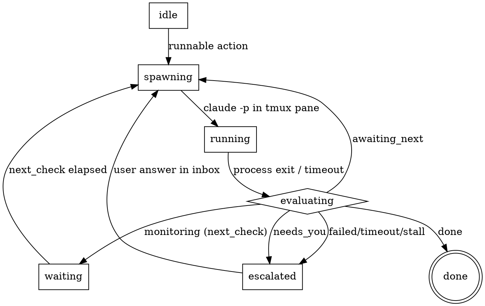

# Agent Manager — Autonomous Project Driver (`pmd` + `pmtui`)

**Date:** 2026-08-12
**Status:** Design approved; ready for implementation planning.

## 1. Problem

The user runs long projects end-to-end through the `project-manager` skill: a
file-state coordinator that walks a project through `intake → research → design
→ plan → implement → review → cr → confirming → done`, delegating all code work
to bounded `claude -p` / `codex exec` workers. The coordinator already
distinguishes *in-flight, leave me alone* (`monitoring`) from *I need the human*
(`needs_you`), and it survives restarts because everything durable lives in
`.project-state/`.

Two gaps remain:

1. **It stops more than it should.** Every ambiguity becomes a stop regardless of
   stakes; every external mutation needs approval regardless of reversibility.
   There is no notion of *scope*, so a scratch project and a production change
   interrupt the user at the same rate.
2. **There is no supervisory surface.** The in-session Claude-cron heartbeat
   drives one session from the inside; there is no external process that watches
   *all* projects, confirms each session is doing the right thing, and routes the
   user's attention by stakes.

This project builds an **external, code-based supervisor** that drives coordinator
sessions and only escalates to the user when a decision genuinely needs them,
scaled to the project's scope.

## 2. Goals / Non-goals

**Goals**

- A headless daemon (`pmd`) that drives one or more projects end-to-end by
  spawning coordinator *steps*, watching their file state, detecting stalls, and
  routing escalations.
- A TUI (`pmtui`) that shows every project at a glance and only makes noise for
  escalations above a threshold; lets the user answer a stop, attach to a live
  pane, pause/resume, or change a project's autonomy tier.
- A **per-project autonomy tier** plus a **per-stop risk class** that together
  decide what flows silently vs. what reaches the user. Irreversible/external
  actions always reach the user.
- Determinism and crash-resilience: the daemon holds no authoritative in-memory
  state; the world is rebuilt from disk on restart.

**Non-goals (this project)**

- We are **not** editing the installed `project-manager` skill. This is a new
  codebase; the coordinator conforms to a small contract (§5) and a reference
  coordinator ships for the tracer bullet.
- We are **not** rebuilding the full phase machine, worker routing, or comms
  stack up front. The daemon drives *any* contract-conforming coordinator;
  reusing/adapting the existing skill's phase logic is a follow-on (§13).
- Not replacing agent-deck's session management wholesale. `pmd` owns the panes
  it drives; broader session management stays out of scope.
- No multi-user / networked control plane. Local unix-socket IPC only.

## 3. Decisions (locked during brainstorming)

| Decision | Choice |
|---|---|
| Wiring | **Full external driver.** The daemon is the scheduler; there is no in-session cron/Stop-hook loop. |
| Control model | **Daemon-driven step loop (Approach B).** Coordinator does one unit per invocation, then exits; the daemon drives the next step. |
| Step execution | **Spawn-per-step inside a daemon-owned tmux pane.** Prompt passed as the `claude -p` / `codex exec` argument; completion = process exit. |
| Coordinator↔daemon channel | **Files only** (`.project-state/`). `capture-pane` is used only for the live view and stall diagnostics, never for control decisions (validated in the tmux spike — see §10). |
| Escalation model | **Triage → auto-flow low-stakes, escalate the rest.** |
| Scope model | **Manual per-project autonomy tier + hard per-stop risk-class overrides.** |
| Judgment location | **In the coordinator.** The tier is injected into each step; the coordinator self-suppresses defensible low-stakes forks and logs them. The daemon stays deterministic and only re-checks the risk class as a safety net. |
| Stack | **Rust.** Daemon + `ratatui` TUI; shell out to `tmux`. |

## 4. Architecture

```
                     ┌────────────────────────────────────────┐
                     │              pmd (daemon)                │
   unix socket       │  registry · scheduler · policy · escal.  │
 ┌──────────┐  ◄────►│  tmux driver (trait) · state I/O         │
 │  pmtui   │        └───────────────┬──────────────────────────┘
 │ (view/   │                        │ spawns one step per wake
 │ control) │                        ▼
 └──────────┘             ┌─────────────────────────┐
                          │ tmux pane (daemon-owned) │
                          │  claude -p / codex exec  │  ← one coordinator step
                          └───────────┬─────────────┘
                                      │ reads/writes
                                      ▼
                          .project-state/  (source of truth)
                            state.json · step.json · CURRENT.md · …
```

- **`pmd`** — long-lived. Owns the registry, the per-project step loop, tmux pane
  lifecycle, stall detection, and escalation routing. In-memory state is a cache;
  the authority is on disk.
- **`pmtui`** — connects to `pmd` over a unix socket, subscribes to project
  events, renders the dashboard, and sends control commands (answer, attach,
  pause, retier).
- **Coordinator step** — a bounded `claude -p` / `codex exec` process the daemon
  spawns inside a tmux pane it created. Boots cold from `.project-state/`, does
  one unit, writes state, exits.

## 5. Coordinator step contract

The daemon treats a coordinator as a black box that obeys this contract. Any
implementation (the reference coordinator, or a future adaptation of the
`project-manager` skill) that honors it can be driven.

**Each step, when invoked, MUST:**

1. Boot from `.project-state/` (read `CURRENT.md`, `state.json`, `step.json`).
2. Do **one** meaningful unit of work (advance a phase, dispatch/verify a worker,
   poll a dependency, resolve a low-stakes fork, etc.).
3. Apply the injected `autonomy` tier: resolve defensible low-stakes forks itself
   and append a source-attributed entry to `decisions.md`; only raise a stop when
   the risk class (§8) requires the human.
4. Write the resulting posture and next action to `state.json` / `step.json`,
   then **exit**. Exit code `0` = clean step; non-zero = failed step.

**The daemon guarantees:**

- Exactly one step per project runs at a time (enforced by the existing
  `pm-lock.sh` lease).
- The step prompt carries: the tier, the project root, and any pending user
  answers from the answer inbox (§6).
- On clean exit it reads the new state and drives the next transition; on
  non-zero exit or timeout it treats the step as stalled (§11).

## 6. State & protocol (files)

Reuse the existing `.project-state/` schema. Add two things:

**`config.json` gains `autonomy`:**

```jsonc
{ "autonomy": "standard" }   // "autopilot" | "standard" | "guardian"
```

**`step.json` — the daemon↔coordinator step protocol:**

```jsonc
{
  "id": 42,                       // monotonic step counter; daemon detects advance
  "status": "awaiting_next",      // awaiting_next | monitoring | needs_you | done
  "next_action": "dispatch task-4",
  "next_check": null,             // epoch; required when status == monitoring
  "started_at": 1786519000,
  "ended_at": 1786519040,
  "exit_reason": "clean"          // clean | failed | timeout (written by daemon on abnormal exit)
}
```

**Answer inbox** — `answers.json`, appended by the daemon when the user resolves an
escalation, read by the next step:

```jsonc
[
  { "stop_id": "stop-2026-08-12-01", "answer": "B", "note": "use the queue-backed path",
    "answered_by": "user", "answered_at": 1786519100 }
]
```

Stops themselves stay in the existing `open_stops[]`, extended with a
`risk_class` field (§8). `run.posture` in `state.json` remains the human-readable
mirror; `step.json.status` is the machine authority the daemon acts on.

## 7. The daemon step loop (per project)

State machine the scheduler runs on each tick (default ~5 s), keyed off
`step.json.status`:



- **`awaiting_next`** → spawn the next step immediately (this is B's continuous
  drive; work advances step-by-step without a human).
- **`monitoring`** → sleep until `next_check`, then spawn a poll step.
- **`needs_you`** → run the risk×tier gate (§8). If it must escalate, route it
  (§9) and wait for an answer; otherwise (safety-net auto-flow) drop a synthetic
  answer and spawn.
- **`done`** → stop driving; keep the project visible in the TUI.
- **failed / timeout / stall** → §11.

## 8. Autonomy policy

Two inputs decide escalation:

**Per-project tier** (`config.autonomy`), injected into every step:

- `autopilot` — resolve every low/medium-risk fork; escalate only hard-risk.
- `standard` — resolve low-risk; escalate medium- and hard-risk.
- `guardian` — escalate anything non-trivial.

**Per-stop risk class** (`open_stops[].risk_class`), set by the coordinator when
it raises a stop:

| Risk class | Examples | Behavior |
|---|---|---|
| `hard` | publish, deploy, merge/land, credentials, payments, destructive/irreversible, `confirm_done` | **Always escalate**, every tier. No tier can auto-flow these. |
| `medium` | non-obvious design fork, dependency choice, scope expansion | Escalate unless `autopilot`. |
| `low` | naming, defensible either-way detail, retry a flaky worker once | Coordinator resolves + logs; never reaches the daemon under any tier. |

The coordinator applies this itself (judgment lives there). The daemon **re-checks
`risk_class` as a safety net**: a `hard` stop is always escalated even if a buggy
coordinator marked it auto-flowable. This is the "safe by construction" property.

## 9. Escalation & notification

When the daemon escalates, loudness scales with `risk_class × tier`:

- **TUI badge** — always. The project row shows a `needs_you` marker and the
  question.
- **Desktop notification** — for `medium`+ or configurable.
- **Slack / external** — for `hard`, reusing the coordinator's existing comms
  destination when configured.

The user answers via `pmtui` (or a Slack reply the coordinator already polls).
`pmtui` writes to `answers.json` via `pmd`; the daemon then spawns the next step,
which consumes the answer. No `send-keys` needed for this path.

## 10. tmux integration (spike-validated)

Validated primitives (`tmux 3.6a`): `new-session -d`, `send-keys`,
`has-session`, `kill-session`, `capture-pane`. The daemon owns a pane per active
step and:

- **spawns** the step as the pane's command (prompt is an argument, not typed);
- **checks liveness** with `has-session`;
- **captures** pane tail via `capture-pane -p` **only** for the live view and for
  attaching diagnostics to a stall escalation;
- **tears down** with `kill-session` after the step exits.

**Spike learning:** `capture-pane` on a freshly detached session returned empty,
and scraping a live TUI pane (ANSI, redraws) is unreliable. Therefore control
decisions read `.project-state/` files exclusively; pane text is diagnostic only.
`send-keys` is reserved for the rare mid-step interjection.

## 11. Concurrency, crash recovery, error handling

- **One driver per project.** The daemon acquires the existing `pm-lock.sh` lease
  before spawning a step; a manual run or a second daemon cannot double-drive.
- **Daemon restart.** No authoritative memory. On start it scans the registry,
  re-reads each `.project-state/`, reconciles any pending operation (existing
  idempotent-operation rules), and resumes the loop.
- **Step crash / non-zero exit.** The last durable checkpoint is intact. The
  daemon re-runs the step from state. After `N` consecutive failures (config,
  default 3) it escalates a `stuck` stop with the captured pane tail + log.
- **Stall.** A step exceeding its timeout, or a pane alive past a deadline with no
  `step.json.id` advance, is killed and escalated as `stuck`.
- **Poison project.** A project that repeatedly fails to boot (invalid state) is
  paused and surfaced, never silently retried in a tight loop.

## 12. Modules & interfaces (Rust)

Isolated units, each independently testable:

- **`registry`** — projects the daemon manages: `{ id, root, tmux_prefix, tier,
  enabled }`. Persisted to a daemon config file; mutated via `pmtui`.
- **`state`** — typed read/write over `.project-state/` (`state.json`,
  `step.json`, `config.json`, `answers.json`, `open_stops[]`). The only module
  that knows the on-disk schema.
- **`tmux`** — a `Driver` trait (`spawn_step`, `is_alive`, `capture_tail`,
  `kill`). Real impl shells to `tmux`; a fake impl backs unit tests.
- **`scheduler`** — the per-project step loop (§7). Pure logic over `state` +
  `tmux` + `policy`, so it is testable with fakes.
- **`policy`** — the risk×tier gate (§8). Pure function
  `(tier, stop) -> Escalate | AutoFlow`.
- **`escalation`** — routes an escalation to transports (TUI event, desktop,
  Slack) by severity.
- **`ipc`** — unix-socket protocol between `pmd` and `pmtui` (event stream +
  command RPCs).
- **`tui`** — `ratatui` rendering + input; a thin client over `ipc`.

## 13. Milestones (build order)

1. **Tracer bullet — the loop end-to-end.** `state` + `tmux` (real) + `scheduler`
   + a *reference coordinator* that is a tiny script advancing a toy 3-step
   project (`awaiting_next → needs_you → done`). Prove: spawn-in-pane, detect
   exit, read state, escalate a stop, accept an answer from a file, resume,
   finish. No TUI yet — assert via logs/state.
2. **Policy + escalation.** Add the tier/risk gate and the safety-net re-check;
   escalate to desktop notification. Prove auto-flow vs. escalate on a fixture set
   of stops.
3. **IPC + TUI.** `pmd` exposes the socket; `pmtui` renders the dashboard, answers
   stops, attaches to a pane, pauses/resumes, retiers.
4. **Robustness.** Stall/timeout detection, crash recovery, lease integration,
   poison-project handling.
5. **Real coordinator.** Replace the reference coordinator with a
   contract-conforming harness (adapt the `project-manager` skill's phase logic to
   single-step, tier-aware execution). Tracked as its own spec.

## 14. Testing strategy

- **Unit** — `policy` (pure, exhaustive tier×risk table), `scheduler` (fake
  `tmux` + fixture states driving every transition), `state` (round-trip
  serialization).
- **Integration** — real throwaway tmux sessions (`pm-test-*`), a reference
  coordinator script, asserting the full loop and teardown. Spike confirmed the
  primitives are available.
- **Fault injection** — kill a pane mid-step, corrupt a `state.json`, stall a
  step, restart the daemon; assert recovery and no double-drive.

## 15. Open questions (resolve in planning, not blocking)

- Reference-coordinator language for the tracer bullet: a bash script is enough to
  prove the loop; the real coordinator is Milestone 5.
- Desktop-notification mechanism on this Linux host (e.g., `notify-send`
  availability) — detect and degrade to TUI-only if absent.
- Whether `pmd` also *creates* the initial project session or only drives existing
  registered projects (leaning: it creates panes for steps it spawns; it does not
  own a persistent per-project session).
